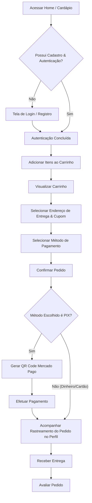
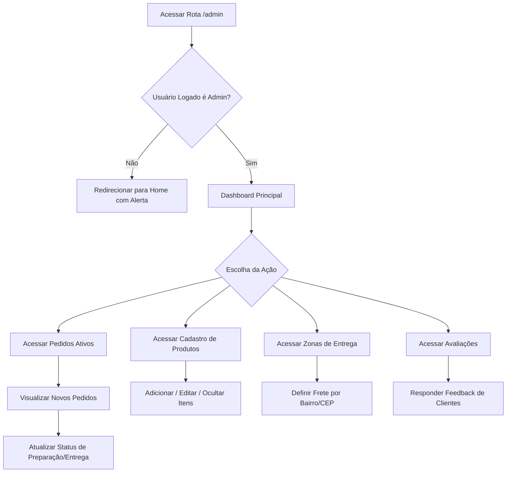

# Capítulo 5: Interface do Usuário e Navegação

Este capítulo apresenta os aspectos visuais, de interação e de experiência do usuário (UX) adotados no desenvolvimento do sistema **Excelencia**. São detalhados a estrutura das principais telas (wireframes/protótipos), a arquitetura de navegação (mapa do site e fluxogramas) e as diretrizes de usabilidade implementadas para garantir uma plataforma intuitiva, acessível e responsiva.

---

## 5.1. Protótipos e Descrição das Telas

O sistema Excelencia adota uma interface moderna baseada na especificação do **Tailwind CSS**, priorizando elementos visuais limpos, alto contraste de leitura e foco na experiência de compra rápida. A disposição dos elementos foi projetada para facilitar a navegação em dispositivos móveis (abordagem *mobile-first*) e desktops.

### 5.1.1. Tela Inicial (Página de Boas-Vindas)
* **Objetivo:** Capturar a atenção do usuário, apresentar a marca e destacar os principais produtos (destaques do cardápio).
* **Organização Visual:**
  * **Cabeçalho (Header):** Fixado no topo, contém a logomarca no canto esquerdo e o menu de navegação global (Home, Cardápio, Avaliações, ícone do Carrinho de Compras com contador dinâmico e botão de Acesso/Perfil) no canto direito.
  * **Seção Hero (Banner Principal):** Apresenta uma imagem profissional de alta qualidade dos produtos, acompanhada de um título de impacto (slogan) e um botão de chamada para ação (CTA) proeminente: *"Ver Cardápio"*.
  * **Seção de Destaques:** Grid responsivo exibindo até 8 produtos sinalizados como "destaque" no banco de dados. Cada card de produto exibe imagem, nome, categoria, preço formatado e botão rápido de adição.
  * **Rodapé (Footer):** Informações de funcionamento, endereço da loja, redes sociais e links de rodapé.

### 5.1.2. Cardápio Interativo
* **Objetivo:** Permitir ao usuário explorar a totalidade dos produtos organizados por categorias.
* **Organização Visual:**
  * **Navegação de Categorias:** Barra lateral (desktop) ou menu horizontal deslizante (mobile) com filtros por categorias (ex: Lanches, Bebidas, Sobremesas).
  * **Grade de Produtos (Grid):** Exibição dos cards dos produtos disponíveis. Cada card possui:
    * Foto real do item;
    * Título do produto e descrição resumida dos ingredientes;
    * Preço em destaque;
    * Campo de observação rápida (ex: "Sem cebola");
    * Botão chamativo *"Adicionar ao Carrinho"* com feedback visual ao ser clicado.

### 5.1.3. Tela de Autenticação (Login e Cadastro)
* **Objetivo:** Fornecer um portal de entrada seguro para novos usuários e clientes existentes.
* **Organização Visual:**
  * **Layout Split/Card:** Centralizado na tela, com transições suaves para alternar entre as abas de "Login" e "Cadastro".
  * **Campos de Entrada:** Inputs limpos com identificação clara (Placeholder e Labels flutuantes):
    * Login: Email e Senha.
    * Cadastro: Nome Completo, Email, Telefone de Contato (com máscara de formatação) e Senha.
  * **Mensagens de Validação:** Alertas em vermelho posicionados logo abaixo do respectivo campo que falhou na validação de dados (ex: "Senha deve conter no mínimo 8 caracteres").

### 5.1.4. Carrinho de Compras
* **Objetivo:** Revisar os itens escolhidos, aplicar cupons, simular taxas e selecionar a forma de entrega e pagamento.
* **Organização Visual:**
  * **Lista de Itens:** Coluna principal mostrando os itens adicionados, preços unitários e controles de alteração de quantidade (`+` / `-`), além do botão de remoção rápida.
  * **Painel de Resumo da Compra (Sidebar):**
    * Campo para inserção e aplicação de cupom de desconto promocional;
    * Seleção do endereço de entrega cadastrado com exibição do frete correspondente (calculado dinamicamente com base nas zonas de entrega cadastradas);
    * Seleção do método de pagamento (Dinheiro - com campo dinâmico de "Troco para quanto?", Cartão de Crédito/Débito ou PIX via Mercado Pago);
    * Subtotal, Descontos aplicados, Valor do Frete e Valor Total em destaque;
    * Botão finalizador: *"Confirmar Pedido"*.

### 5.1.5. Perfil do Cliente (Painel do Usuário)
* **Objetivo:** Centralizar os dados do usuário, gerenciamento de múltiplos endereços e histórico de compras.
* **Organização Visual:**
  * **Dados Pessoais:** Formulário para atualização de nome, email e telefone, além de uma seção dedicada para redefinição de senha.
  * **Endereços de Entrega:** Grid contendo os endereços cadastrados pelo usuário. Cada card exibe a identificação (Ex: "Casa", "Trabalho"), o CEP, logradouro, número e bairro. Apresenta opções para: *Definir como Padrão*, *Editar* ou *Excluir*.
  * **Histórico de Pedidos:** Tabela/Lista cronológica exibindo os pedidos realizados, contendo número do pedido, data, valor total, método de pagamento, status atual (Pendente, Preparando, Saiu para Entrega, Entregue) e a opção de detalhar o pedido. 
  * **Mecanismo de Avaliação:** Para pedidos com status "Entregue", é exibido um botão para abrir o formulário de avaliação direta do pedido (atribuição de estrelas de 1 a 5 e comentários adicionais).

### 5.1.6. Dashboard Administrativo (Painel do Admin)
* **Objetivo:** Permitir aos gerentes e funcionários gerenciar pedidos em tempo real, cadastrar produtos, configurar categorias e zonas de entrega.
* **Organização Visual:**
  * **Menu Lateral de Controle (Sidebar):** Links para Dashboard (Início), Pedidos Ativos, Cadastro de Produtos, Gerenciamento de Categorias, Respostas a Avaliações e Zonas de Entrega.
  * **Painel de Pedidos Ativos:** Kanban ou lista organizada pelo status do pedido. Permite a atualização do status com apenas um clique (ex: Mover de "Confirmado" para "Preparando") com atualização assíncrona.
  * **Cadastro de Produtos (CRUD):** Formulário completo com upload de imagens, seleção de categoria vinculada, definição de preço, marcação de item em destaque e botão de ativação/desativação no cardápio.
  * **Zonas de Entrega:** Área para gerenciar os bairros e faixas de CEP atendidos, permitindo estipular valores de frete diferenciados por região para otimizar os custos de logística.

---

## 5.2. Padrões de Navegação

A navegabilidade do sistema foi projetada de forma híbrida: usando navegação global e estrutural para a movimentação entre as seções principais da plataforma, e navegação contextualizada (links, botões dinâmicos e fluxos lineares) para a condução do usuário na realização das tarefas (compra, pagamento, cadastro de endereço).

### 5.2.1. Mapa do Site (Sitemap)

A árvore hierárquica das páginas estruturadas no sistema está configurada conforme o organograma abaixo:

```
[Início] (Pública)
 ├── [Cardápio] (Pública)
 ├── [Avaliações Públicas] (Pública)
 ├── [Login / Cadastro] (Pública)
 │
 ├── [Painel do Cliente] (Requer Autenticação)
 │    ├── [Editar Dados Pessoais]
 │    ├── [Gerenciar Endereços]
 │    └── [Histórico de Pedidos] (com opção de Avaliação)
 │
 ├── [Carrinho de Compras] (Requer Autenticação)
 │    └── [Finalização de Compra / Checkout]
 │         └── [Tela de Pagamento - QR Code Pix / Conclusão]
 │
 └── [Painel Administrativo] (Requer Autenticação Administrativa)
      ├── [Dashboard com Métricas]
      ├── [Gestão de Pedidos]
      ├── [Gerenciamento de Produtos & Categorias]
      ├── [Controle de Zonas de Entrega & Frete]
      └── [Moderação de Avaliações]
```

### 5.2.2. Fluxogramas de Navegação

Os fluxos a seguir representam o percurso dos usuários na execução de tarefas chave dentro do sistema:

#### A. Fluxo de Compra e Pagamento (Cliente)
Este fluxo representa o caminho que o cliente percorre desde o primeiro contato até o pagamento por PIX integrado na plataforma:



#### B. Fluxo de Gerenciamento Operacional (Administrador)
Representa o caminho que o administrador percorre para atualizar os pedidos e gerenciar o estabelecimento comercial:



---

## 5.3. Diretrizes de Usabilidade (UX/UI)

Para garantir que o sistema Excelencia atenda a elevados níveis de satisfação e facilidade de uso, foram observadas diversas regras fundamentais de Experiência do Usuário (UX) e as principais heurísticas de usabilidade durante o desenvolvimento front-end:

### 5.3.1. Consistência e Padronização Visual
* **Paleta de Cores Coesa:** Utilização de cores quentes e limpas para remeter ao setor alimentício/delivery, com o uso consistente de tons escuros para textos principais e elementos interativos em destaque.
* **Componentização Reutilizável:** Elementos como o Cabeçalho, Rodapé, botões de ação e modais seguem os mesmos estilos e comportamentos em todo o site. Um botão primário de confirmação possui sempre a mesma cor corporativa, o mesmo arredondamento de borda (*border-radius*) e o mesmo comportamento ao passar o cursor (*hover*).
* **Tipografia:** Uso da fonte com tamanhos e pesos hierárquicos bem delimitados para distinguir imediatamente títulos, subtítulos, corpo de texto e etiquetas de preço.

### 5.3.2. Prevenção e Tratamento de Erros
* **Feedback Visual Clara:** Ao preencher um formulário (como o de cadastro ou endereço), os inputs mudam de cor para indicar sucesso (borda verde) ou erro (borda vermelha com mensagem explicativa logo abaixo).
* **Validação em Duas Camadas:** A validação ocorre em tempo real no cliente (JavaScript) para poupar requisições desnecessárias, e é rigidamente validada no servidor (Laravel Form Validation), retornando mensagens em português amigáveis caso o usuário tente burlar as regras locais.
* **Confirmação de Ações Destrutivas:** Ações críticas, como excluir um endereço ou cancelar um pedido pendente, exigem confirmação em caixas de diálogo ou modais intuitivos, impedindo cliques acidentais.

### 5.3.3. Flexibilidade e Eficiência de Uso (Responsividade)
* **Layout Adaptável:** A interface é 100% responsiva (grides e flexbox no CSS). Em telas de celulares, o menu administrativo se contrai, as tabelas tornam-se cartões empilháveis e o carrinho de compras ajusta-se para visualização em bloco vertical, garantindo que o usuário possa realizar seu pedido na rua ou em casa com o mesmo conforto técnico.
* **Facilidade de Aprendizado:** O fluxo de fechamento de pedido segue o padrão clássico consolidado no mercado de e-commerce mundial (Adicionar -> Ir para o Carrinho -> Revisar -> Escolher Pagamento -> Confirmar), o que minimiza a curva de aprendizado do cliente.

### 5.3.4. Visibilidade do Status do Sistema
* **Indicadores Dinâmicos:** Ao adicionar um item ao carrinho, o ícone de sacola de compras no cabeçalho atualiza imediatamente o número de itens em tempo real, sem necessidade de recarregar a página (*Ajax/Axios*).
* **Acompanhamento do Pedido:** O cliente consegue visualizar claramente o andamento do seu pedido através de um histórico de status linear (Pendente -> Confirmado -> Em Preparação -> Saiu para Entrega -> Entregue), sabendo exatamente qual etapa do serviço está ocorrendo.

### 5.3.5. Acessibilidade
* **Contrastes Adequados:** A relação de contraste entre as cores do texto e o fundo segue as diretrizes da WCAG para garantir legibilidade para pessoas com baixa visão ou sob luz solar direta.
* **Navegabilidade por Teclado:** Elementos interativos utilizam tags semânticas apropriadas (`<button>`, `<a>`, `<input>`), garantindo foco visível e usabilidade via leitor de telas.
* **Atributos Descritivos:** Imagens dos produtos no cardápio carregam o atributo `alt` preenchido com a descrição textual do produto, garantindo acessibilidade a deficientes visuais.
